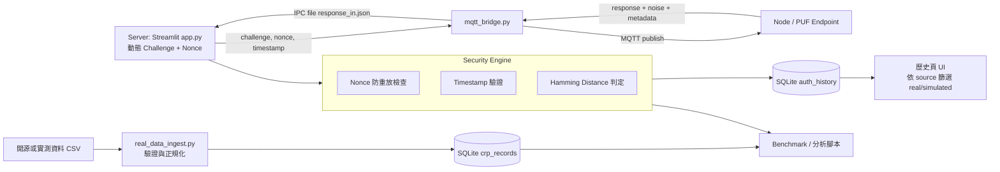

# 系統資料流架構圖

## 簡述
1. 即時驗證路徑：Server 發 challenge，Node 回 response，Security Engine 執行 nonce、timestamp、HD 驗證後寫入資料庫。
2. 資料集路徑：開源/實測 CSV 先經 `real_data_ingest.py` 檢查，再寫入 `crp_records`。
3. 分析路徑：分析腳本可同時吃即時驗證資料與匯入資料做 FAR/FRR/EER 對照。

